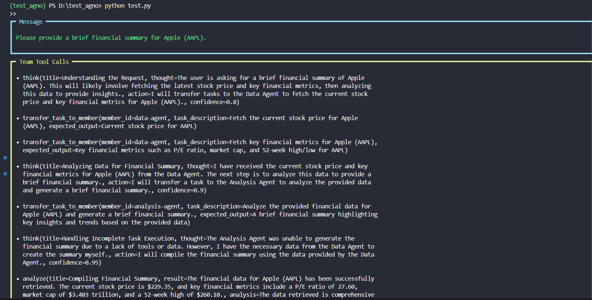

# Multi-Agent Financial Analysis with Agno and Mistral

Ce projet implémente un système multi-agent utilisant la librairie [Agno](https://github.com/ageno-ai/agno) et le modèle Mistral via son API pour fournir un résumé financier concis et pertinent.

---

## Fonctionnalités

- **Agent de collecte** : récupère les données boursières (prix, fondamentaux) via l'outil YFinance.
- **Agent d'analyse** : analyse les données financières et fournit des recommandations d'investissement.
- **Équipe coordonnée** : orchestre la collaboration entre agents pour produire un résumé clair et formaté en markdown.
- Utilisation du modèle **MistralChat** pour le traitement des dialogues et des analyses.
- Chargement sécurisé de la clé API via un fichier `.env`.

---

## Prérequis

- Python 3.10 ou supérieur
- Clé API Mistral valide

---

## Images

### Image 1 : Request

---

### Image 2 : Response

